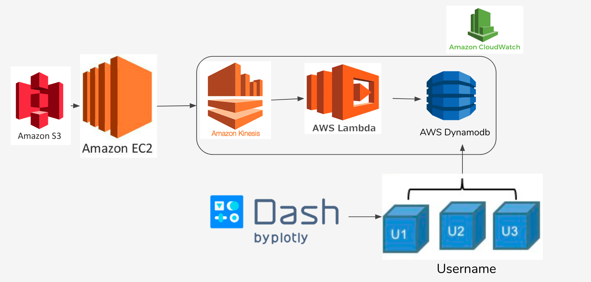

# StockAlert
Justin Wang's Insight-BOSTON-20A Data Engineering Project

## Table of Contents
1. [Problem](README.md#problem)
1. [Pipeline](README.md#Pipeline)
1. [Running Instructions](README.md#running-instructions)
1. [Demo](README.md#demo)
1. [Files in Repo](README.md#files-in-repo)
1. [Engineering Challenges](README.md#Engineering-Challenges)
1. [Contact Information](README.md#contact-information)

## Problem

A once-every-three-years study by the Federal Reserve Board found that in 2016, 51.9 percent of United States families owned stocks, either directly or as part of a fund. But most of them are fulltime workes and, at the same time, busy parents. There isn't much time for them to watch the market. Usually they are the ones got stuck when a crash happens. 

*Solution:* The goal of this program is to process real-time stock transaction information and alert users when stocks in their watchlists have big fluctuations.

## Pipeline

* The input data is stored on Amazon S3.
* One Amazon EC2 instance is deployed to read and put records to Kinesis.
* The records streamed through Kinesis and triggered Lambda to process. 
* The output are stored on Dynamodb. 

## Demo

[Here](https://youtu.be/KMAP3Op4jkI) you can see a video of my application in the works. 

In the first part, you can see an example of data that is stored in an S3 Bucket. Then you see the front end, where the information is inputted. Then the program is run and we return to the S3 Bucket to see that our information is now there. Once we look at it, we see that the columns that were specified have been encrypted. 

[Here](https://youtu.be/rsZm3JbHMSM) you can watch a video of my presentation where I discuss this project, along with my [slides](https://docs.google.com/presentation/d/1ZI-L-aVYDdLWXpPOYjrs-DwDfPyZH8OSLtSQ9Szt1EA/edit?usp=sharing). 

## Engineering Challenges
Latency - Solution: Fan-out problem with creating multiple shards 

Cost - Solution: Autoscaling split and merge shards as input requires

## Contact Information
* Wangzqi@gmail.com
